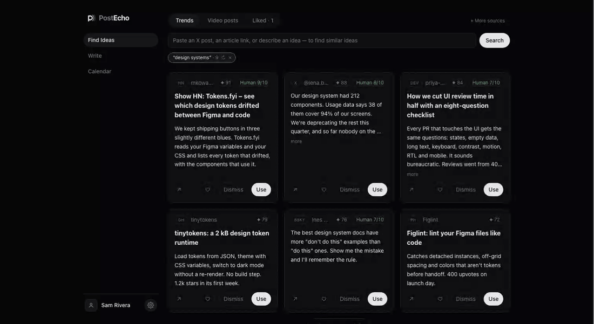
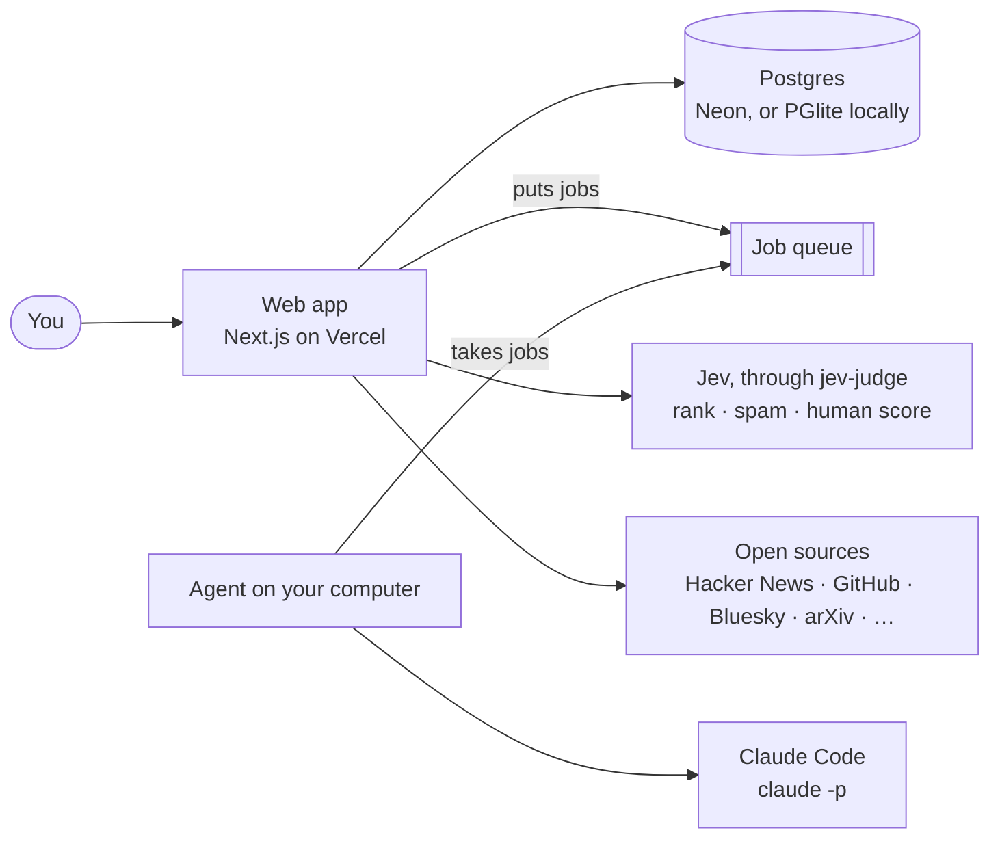

<p align="center">
  
</p>

<h1 align="center">postecho</h1>

<p align="center">
  Find a topic and draft posts from your writing examples.<br>
  A self-hosted writing assistant for X and LinkedIn. You review and schedule each post yourself.
</p>

<p align="center">
  <a href="https://github.com/simojam93/postecho/actions/workflows/ci.yml"></a>
  <a href="LICENSE"></a>
</p>

<p align="center">
  
</p>

> **Who it's for:** people who post on X and LinkedIn and want to run their own writing assistant.
> Each install has one owner. Writing requires [Claude Code](https://code.claude.com/docs/en/overview)
> logged in with your Claude plan. [Jev](https://typesafe.ai) optionally ranks results and gives feedback
> on writing style. The preview above uses fictional sample data.

## What it does

**Find.** Search sources including Hacker News, GitHub and arXiv. Some sources need credentials.
Jev ranks results when enabled; search also works without it.


**Turn a video into posts.** Get twelve X drafts from a YouTube transcript. If unavailable, postecho
can use the description and chapters, or you can paste a transcript. Check facts and add attribution before publishing.


**Compose.** Choose an idea for three drafts based on your writing examples and style guide.
Pick one and ask for changes, such as a shorter version or a LinkedIn post.


**Calendar.** Open X or LinkedIn to schedule a post, then record its time in postecho.
If you change that time on the platform, update postecho too.


## What makes it different

- **Your writing examples guide the drafts.** Proposed style-guide updates wait for your approval.
- **Optional style feedback.** Jev scores AI-like writing patterns. Humanize tries up to three rewrites
  and keeps the best-scored result. The score is a model's assessment.
- **Visible progress.** Searches and writing jobs show their current step and elapsed time.
- **Your Claude Code login.** The local agent uses your Claude plan, subject to its usage limits.
- **Manual publishing.** You review each draft and schedule it in the platform's own composer.
- **Local hosting.** Run the app and database on your computer, or deploy the web app separately.

## Built by

[Simone Lovera](https://github.com/simojam93), CPO at [Forte AI](https://www.forte-ai.com), designed and
built postecho with Claude Code. Read the [design case study](docs/case-study.md).

---

## Run it

You need Git, macOS or Linux, and Node 22.9 or newer. To generate or revise text, install
[Claude Code](https://code.claude.com/docs/en/overview) and log in with your Claude plan.

```bash
git clone https://github.com/simojam93/postecho && cd postecho
npm run setup   # installs dependencies and prepares the local database
npm run demo    # optional: adds fictional sample data
npm run dev     # starts the web app and local agent
```

Open the address `npm run dev` prints, http://localhost:3000 unless another program already uses that port, and log in with the password chosen or generated during setup.
With sample data loaded, open Compose to inspect the example drafts. Generating new text requires Claude Code.

For a first live task, add writing examples in Settings, search a topic in Find Ideas, and use a result
to generate three drafts. Choose one and edit it in Compose.

Add optional service keys in Settings. For online hosting, see [the deploy guide](docs/deploy.md).

## What it costs

postecho's code is free. Connected services have their own costs and limits.

| | What for | Cost |
| --- | --- | --- |
| **Claude** | Generating and revising text | Your Claude plan and its usage limits |
| **Jev** by TypeSafe | Optional ranking and style feedback | TypeSafe's pricing |
| **X's API** | Optional X search | X's API pricing |
| **Vercel, Neon** | Optional online hosting | Provider plans and limits; Vercel Hobby is for personal, non-commercial use |

## How it works



The web app queues jobs. An agent on your computer runs Claude Code and returns the results.
The page wakes the agent on your computer when it creates a job, so the agent sends nothing while PostEcho is closed.
Keep that agent running for writing jobs, including when the web app is hosted online.
Text used for writing goes to Claude; enabling Jev sends text for evaluation to TypeSafe.

Jev integration uses [jev-judge](https://github.com/simojam93/jev-judge), an MIT library included in
`web/vendor/`. See [Contributing](CONTRIBUTING.md#plugging-in-another-ai-writer) to add another writer.

| Folder | What's in it |
| --- | --- |
| [`web/`](web/) | Web interface, API and database access. |
| [`agent/`](agent/) | Local worker that runs Claude Code. |
| [`scripts/`](scripts/) | Setup, development and sample-media scripts. |
| [`docs/`](docs/) | Deployment, case study, specs and plans. |

**Stack:** TypeScript, Next.js 16, React 19, Tailwind CSS 4, Drizzle, Postgres/PGlite, Vitest, Claude Code and Jev.

## Tests

```bash
npm test
```

Runs the web, agent and setup-script tests with local data and test doubles. No service keys are needed.

## Contributing

Help with a bug, a source adapter, setup or another AI writer. Start with
[CONTRIBUTING.md](CONTRIBUTING.md), follow the [code of conduct](CODE_OF_CONDUCT.md), and report
security issues through [SECURITY.md](SECURITY.md).

## License

MIT. See [LICENSE](LICENSE).
