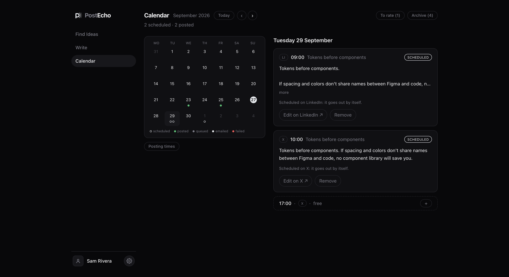
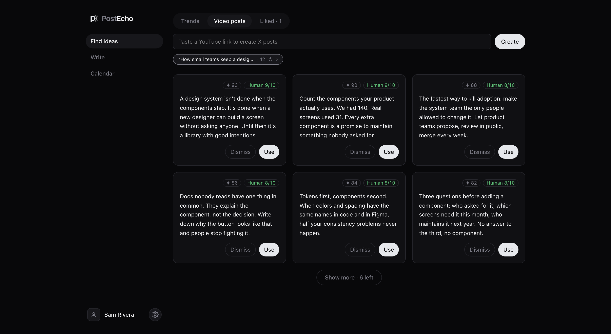
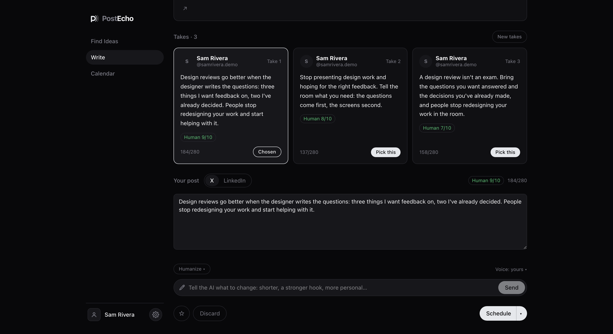
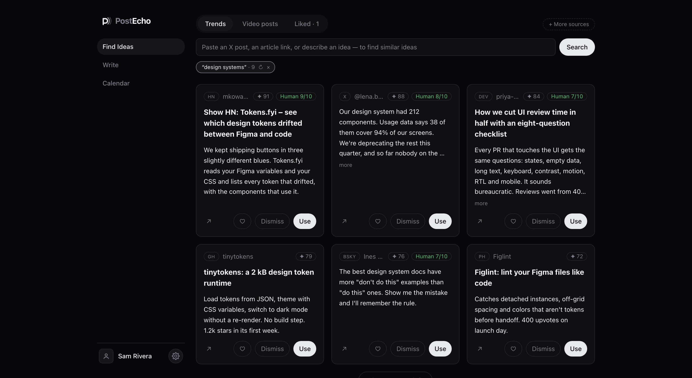

# PostEcho: a case study

I built PostEcho because I was spending too much time looking for something to write about on X. I wanted help finding an idea and getting a first draft down. I still wanted to choose what went out under my name.

PostEcho searches public sources and uses Claude Code to draft posts from my writing examples and style guide. I review the draft, then open X or LinkedIn to schedule it there. The app keeps a calendar of the times I record.

I designed and built it with Claude Code. These are the decisions that shaped it.

## The problem

The part I kept getting stuck on came before scheduling: finding a subject I had something to say about, then turning it into a draft.

A calendar didn't solve that. I wanted to bring the source and the draft into one place, with enough context to decide whether the idea was worth using.

## Who it's for

PostEcho is for people who write on X and LinkedIn and want to run their own writing assistant. Each installation has one owner. It needs some setup, and generating text requires Claude Code with a working login.

You can also load sample data to look around before connecting the writing service.

## The rules

I used a few rules when reviewing the screens:

- Remove controls that compete with the task.
- Explain an action where someone needs the explanation.
- Show progress during long jobs.
- Use the platforms' existing publishing tools.
- Leave the final wording and publishing decision to the person.

## 1. Edit opens the platform

X and LinkedIn hold the scheduled post. Editing a separate copy inside PostEcho would leave two versions to keep track of.

Edit opens X's scheduled-posts page or LinkedIn's composer. After a change, I update the time in PostEcho myself. The calendar doesn't read changes back from either platform.

That manual step is a tradeoff. The interface needs to make it clear which system holds the actual post.

*The calendar shows the times I record after scheduling on X or LinkedIn.*

## 2. I removed a recommendation marker

An earlier version put a green dot on posts that matched what I usually kept. I noticed myself choosing by the dot before reading the text, so I removed it.

The ranking still influences what I see first. Removing the extra marker gives me one less cue to follow before I've read the result.

## 3. Long jobs show their progress

A search and a batch of drafts take different amounts of time. Both show the current step and elapsed time while they run.

If I switch sections, the sidebar shows which job is still working and briefly marks it when it finishes. I can keep using the app without repeatedly checking the same screen.

## 4. A video gives me drafts to review

The first version wrote about the video. The next version offered a list of topics. I wanted to get closer to something I could edit.

The current flow creates twelve X drafts from a video's transcript. If the transcript isn't available, it can use the description and chapters, or I can paste the transcript myself. Long transcripts are capped, so this isn't a claim that the model has watched the whole video.

The prompt asks it not to borrow the speaker's personal experiences. I still need to check the output, make sure it reflects what I think, and credit the source where appropriate. A draft written in my style doesn't make someone else's idea mine.

*Twelve draft posts from a video's transcript, ready for review.*

## 5. Scheduled drafts leave the workspace

Once I mark a draft as scheduled, it moves to the Archive. Write stays focused on unfinished work.

The same Archive is available from Write and Calendar, so I can get back to the draft from either place.

## 6. Rewriting has one main input

The editor used to have separate controls for several kinds of rewrite. I replaced them with one input where I can ask for the change I want.

Humanize and the Voice menu sit beside it. That keeps the common action easy to find without filling the editor with buttons.

*One input for edits, beside Humanize and the Voice menu.*

## The AI, in plain words

Claude writes the drafts using my examples, reference material and style guide. PostEcho calls Claude Code through an agent running on my computer. The text is processed by Claude's service.

Jev, from TypeSafe, is optional. It ranks search results and evaluates patterns in the writing. Humanize can use that feedback for up to three rewrites, keeping the best-scored version. Without scoring, it can still make a single rewrite.

The score is useful feedback, but it doesn't establish whether a person wrote something or whether a draft is good. I read it and decide.

Style-guide changes also need approval. PostEcho proposes an update based on the drafts I keep; I can apply or dismiss it.

The Jev integration is available separately in [jev-judge](https://github.com/simojam93/jev-judge).

## Constraints

PostEcho has an MIT license and runs locally with its own database. Claude and optional services have their own costs and usage limits.

The web app can also be hosted online, but the agent on my computer must be running to handle writing jobs. Self-hosting the app doesn't make the AI processing offline.

Publishing stays manual. PostEcho opens the platform's composer, and I schedule the post there.

## How it was built

The repository includes [design specs](specs), [implementation plans](plans) and tests. I built it with Claude Code and revised the interface as I used it. The recommendation marker and rewrite controls changed because they got in the way during that work.

## Try it

The repository has setup instructions for macOS and Linux with Node 22.9 or newer. After setup, `npm run demo` loads fictional sample data so you can explore the screens. New drafts require Claude Code logged in.

[Code and setup instructions](../README.md#run-it)

If you try it, I'd like to know where you get stuck between finding an idea and finishing a draft.

*Explore the interface with the sample data included in the repository.*
